---
# Feel free to add content and custom Front Matter to this file.
# To modify the layout, see https://jekyllrb.com/docs/themes/#overriding-theme-defaults

layout: page
title: OOD Detection Benchmark
---

The OODDB (OOD Detection Benchmark) is a comprehensive benchmark suite designed to evaluate machine learning models performing
**Out-Of-Distribution Detection**, with a specific focus on its *semantic* aspect (a.k.a. *Semantic Novelty Detection*).
In this task, a model has access to a set of labeled samples (*support set*) that represents the
*known* categories and it has to identify the test samples as either *known* (i.e., belonging to those same classes) or *unknown* (i.e., belogning to other unseen ones).

The benchmark includes datasets depicting different kind of subjects (generic objects, textures, scenes, aerial views), with multiple levels of granularity and across different visual domains.\
In particular, it's designed to test the models both in a **_cross-domain_** and **_intra-domain_** scenario (i.e., with or without a visual domain shift between the support and test distributions), aiming at
an evaluation which is solely centered on the semantic concepts represented by the datasets categories.
The *cross-domain* settings can be further divided into **_single-source_** or **_multi-source_**, depending on whether the labeled data samples belong to one or multiple domains.

We report some visual examples for the supported tracks below (see [Data](#data) for more details): 

**Intra-domain**:

| Dataset | Train (Support) | Test Known | Test Unknown |
| :-: | :-: | :-: | :-: |
| DomainNet Real | 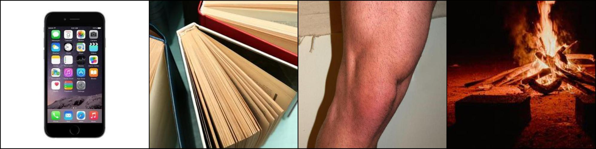 | 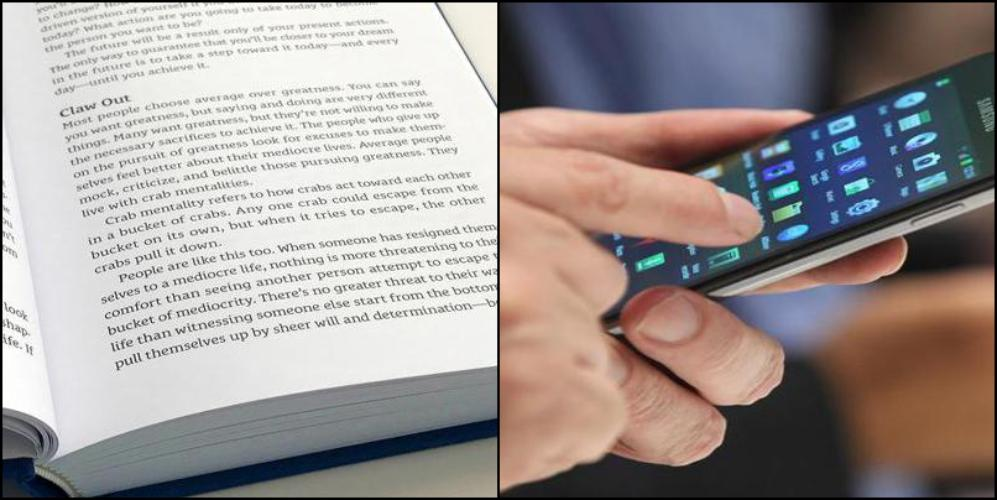 |  |
| DTD | 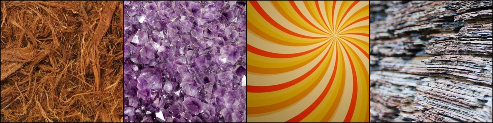 | 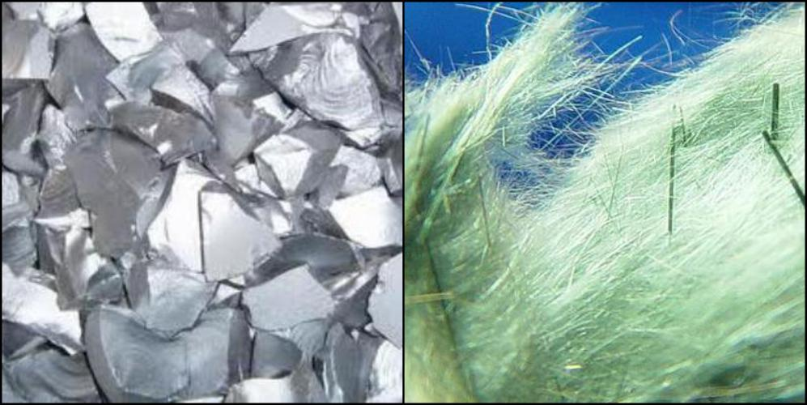 | 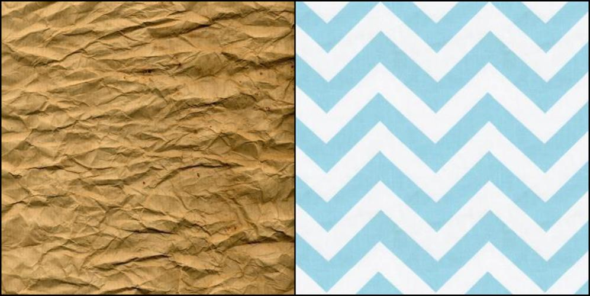 |
| PatternNet | 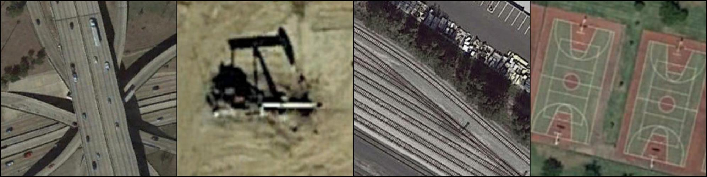 | 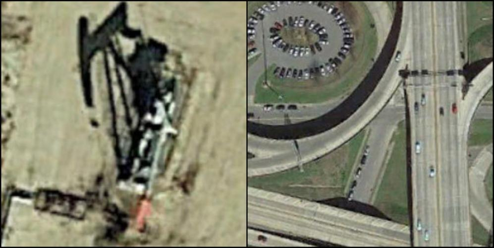 | 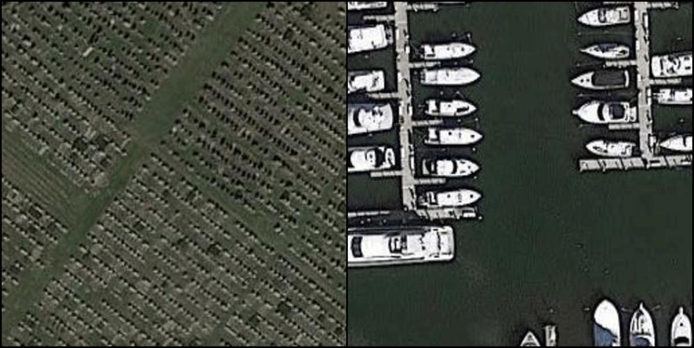 |
| Stanford Cars |  | 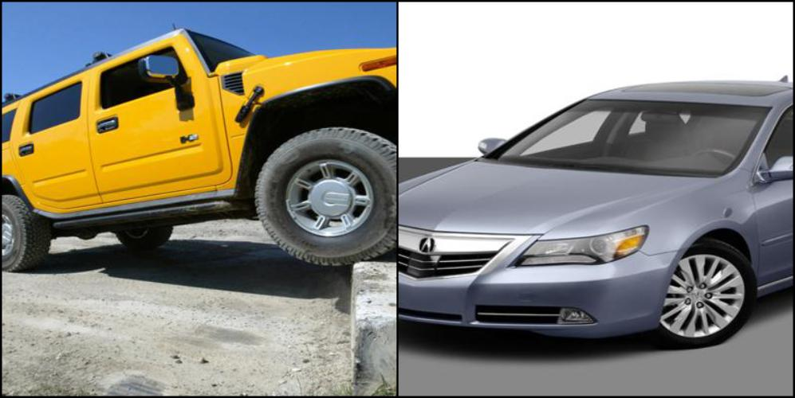 |  |
| SUN | 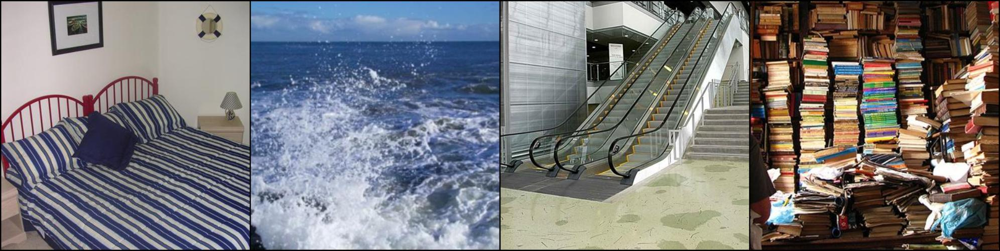 | 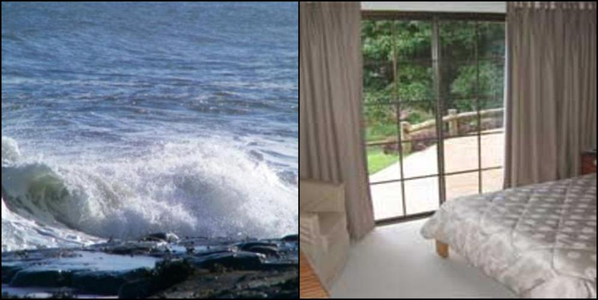 | 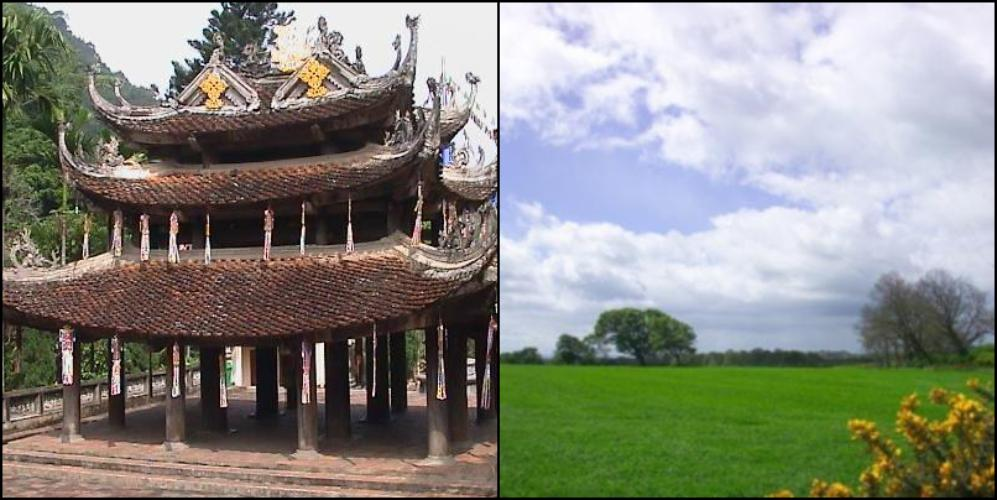 |

**Cross-domain (single and multi-source)**:

| Dataset | Train (Support) | Test Known | Test Unknown |
| :-: | :-: | :-: | :-: |
| Real &rarr; Painting |  |  |  |
| All &rarr; Painting | 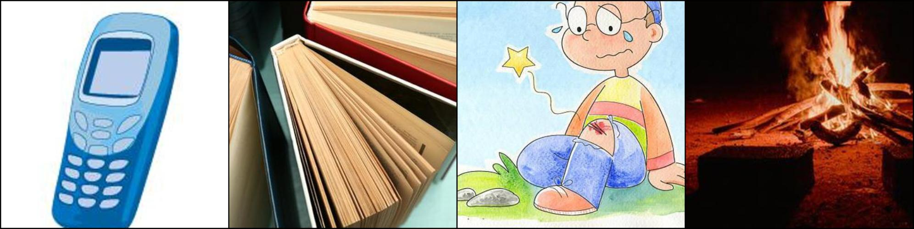 |  |  |

## Data

The benchmark includes the following datasets:
- **DomainNet**
  ([paper ↗](https://arxiv.org/pdf/1812.01754.pdf){:target="_blank"},
  [website ↗](http://ai.bu.edu/M3SDA/){:target="_blank"}, per-domain downloads:
  [clipart](http://csr.bu.edu/ftp/visda/2019/multi-source/groundtruth/clipart.zip),
  [infograph](http://csr.bu.edu/ftp/visda/2019/multi-source/infograph.zip),
  [painting](http://csr.bu.edu/ftp/visda/2019/multi-source/groundtruth/painting.zip),
  [quickdraw](http://csr.bu.edu/ftp/visda/2019/multi-source/quickdraw.zip),
  [real](http://csr.bu.edu/ftp/visda/2019/multi-source/real.zip),
  [sketch](http://csr.bu.edu/ftp/visda/2019/multi-source/sketch.zip)):\
  *intra-domain* settings: 6\
  *cross-domain* settings: 36 (30 *single-source* and 6 *multi-source*)
- **DTD**
  ([paper ↗](https://www.robots.ox.ac.uk/~vgg/publications/2014/Cimpoi14/cimpoi14.pdf){:target="_blank"},
  [website ↗](https://www.robots.ox.ac.uk/~vgg/data/dtd/){:target="_blank"},
  [download](https://www.robots.ox.ac.uk/~vgg/data/dtd/download/dtd-r1.0.1.tar.gz)):\
  *intra-domain* settings: 1
- **PatternNet**
  ([paper ↗](https://faculty.ucmerced.edu/snewsam/papers/Zhou_ISPRS18_Patternet.pdf){:target="_blank"},
  [website ↗](https://sites.google.com/view/zhouwx/dataset#h.p_Tgef10WTuEFr){:target="_blank"},
  [download ↗](https://nuisteducn1-my.sharepoint.com/:u:/g/personal/zhouwx_nuist_edu_cn/EYSPYqBztbBBqS27B7uM_mEB3R9maNJze8M1Qg9Q6cnPBQ?e=MSf977){:target="_blank"}):\
  *intra-domain* settings: 1
- **Stanford Cars**
  ([paper ↗](https://ai.stanford.edu/~jkrause/papers/fgvc13.pdf){:target="_blank"},
  [kaggle ↗](https://www.kaggle.com/datasets/jessicali9530/stanford-cars-dataset){:target="_blank"},
  [download ↗](https://www.kaggle.com/datasets/jessicali9530/stanford-cars-dataset/download?datasetVersionNumber=2){:target="_blank"}):\
  *intra-domain* settings: 1
- **SUN**
  ([paper ↗](https://vision.princeton.edu/projects/2010/SUN/paper.pdf){:target="_blank"},
  [website ↗](https://vision.princeton.edu/projects/2010/SUN/){:target="_blank"},
  [download](http://vision.princeton.edu/projects/2010/SUN/SUN397.tar.gz)):\
  *intra-domain* settings: 1

We provide train and test splits for each dataset. 
A train split represents the ID (*in-distribution*) data (i.e., the *known* classes), thus, it only contains a subset of the categories of the corresponding test split (which instead includes both ID and OOD samples).\
More specifically, for each dataset we performed 3 different random divisions of its categories into *known* (ID) and *unknown* (OOD) ones. We refer to these 3 splits as **_data orders_** and we provide a train-test split for each one of them.
(In order to increase the statistical revelance of the results, it is advisable to
repeat the evaluation for all 3 *data orders* in the given setting and to average the obtained values.)

For more information, see [Datasets]({{site.baseurl}}/datasets/).

## Setup and Usage

You can easily access the splits and run the benchmark by following the instructions we provide on [GitHub ↗]({{site.github_url}}){:target="_blank"}.
